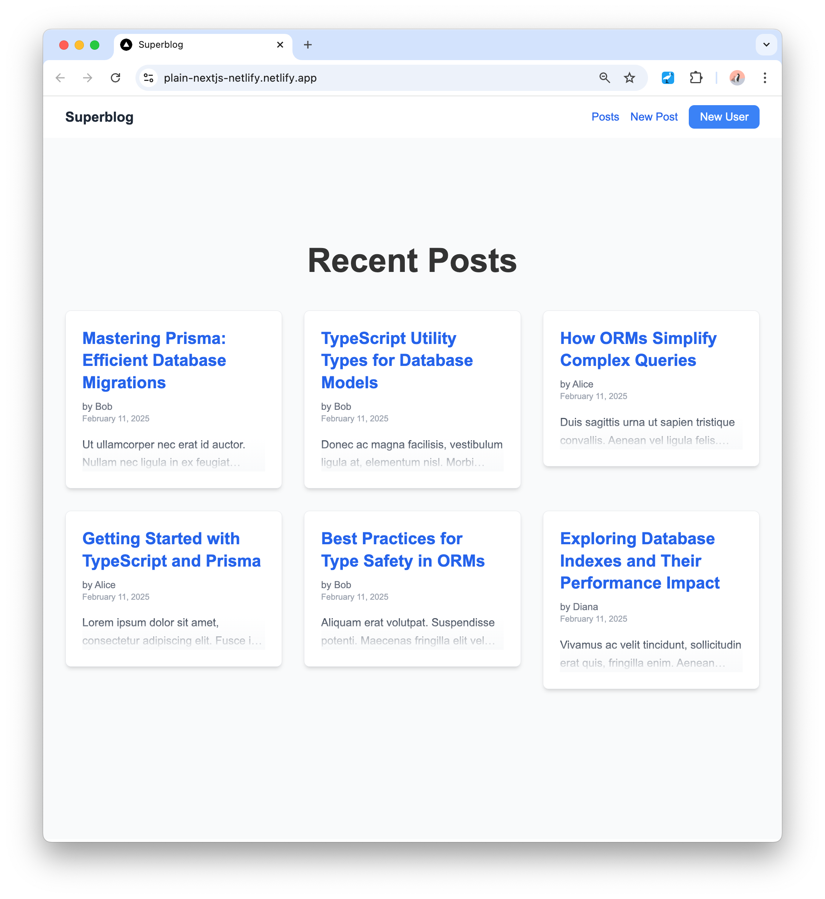

# Next.js & Prisma Postgres starter

This repository provides a boilerplate to quickly set up a Next.js demo application with [Prisma Postgres](https://www.prisma.io/postgres) and [Prisma ORM](https://www.prisma.io/orm), and deploy it to Netlify. It includes an easy setup process and example routes that demonstrate basic CRUD operations against the database.

For the deployment on Netlify, you can use the [Prisma Postgres extension](https://www.netlify.com/integrations/prisma) for Netlify.

## Features

- Next.js 15 app with App Router, Server Actions & API Routes
- Data modeling, database migrations, seeding & querying
- CRUD operations to create, view and delete blog posts
- Pagination, filtering & relations queries

If you want to go further, check out our [Next.js app with Authentication](https://github.com/prisma/nextjs-prisma-postgres-demo) example.

## Getting started

Follow the steps in [USAGE.md](./USAGE.md) to set up this starter template, connect it with Prisma Postgres and deploy to Netlify.

## Next steps

- [Prisma ORM documentation](https://www.prisma.io/docs/orm)
- [Prisma Client API reference](https://www.prisma.io/docs/orm/prisma-client)
- [Join our Discord community](https://discord.com/invite/prisma)
- [Follow us on Twitter](https://twitter.com/prisma)
